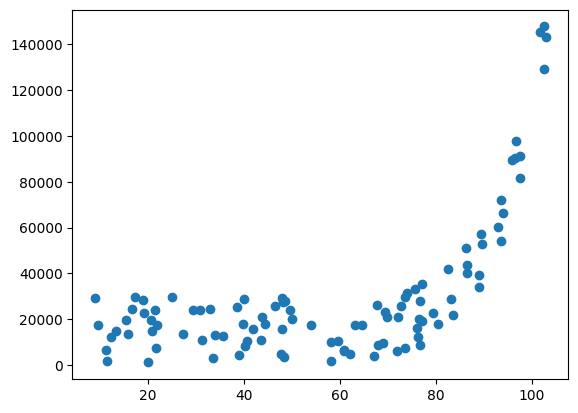
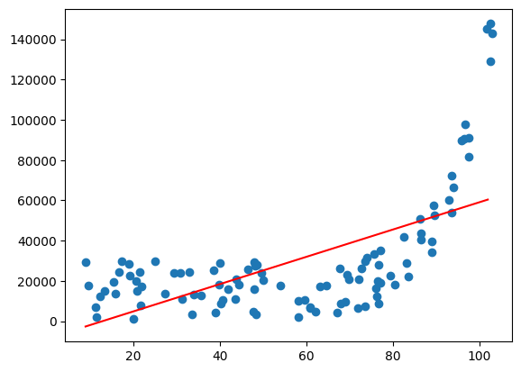
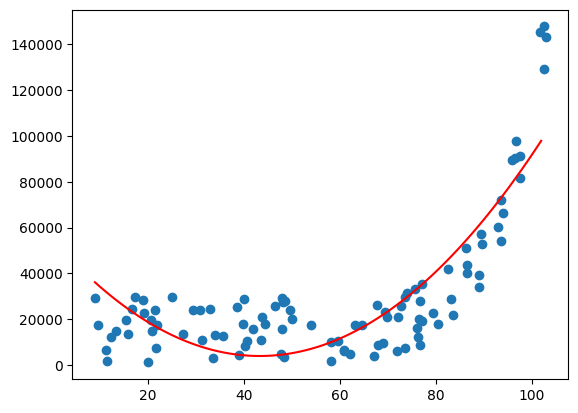
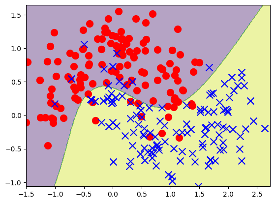
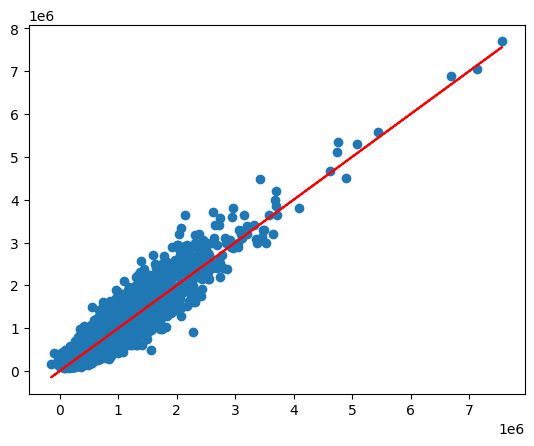

### Полиномиальные модели

#### Цель работы

На практике познакомиться с моделями полиномиальной регрессии и классификации, понять влияние степени полинома на вычислительную сложность и точность модели.

#### Содержание работы

1. Загрузите учебный набор данных для регрессии "gen_regression".
1. Постройте модель парной линейной регрессии, оцените ее эффективность, изобразите модель на графике.
1. Постройте модель полиномиальной регрессии второго порядка. Сравните ее эффективность с первой моделью.
1. Загрузите набор данных для классификации "gen_classification". 
1. Постройте линейную классификацию, изобразите ее на графике и оцените точность.
1. Введите в данные признаки третьего порядка и постройте классификацию. Сравните с предыдущей моделью.
1. Загрузите набор данных, содержащий данные о продаже домов в округе King county, США.
1. Постройте на этом датасете линейную модель и полиномиальную второго порядка. Изобразите на графике и сравните эффективность.

#### Методические указания

Начнем как всегда с импорта необходимых библиотек:

```py
import numpy as np
import pandas as pd
import matplotlib.pyplot as plt
```

##### Парная регрессия

Прочитаем первый датасет по ссылке:

```py
data = pd.read_csv("https://raw.githubusercontent.com/koroteevmv/ML_course/2023/ML3.1%20polynomial%20features/gen_regression.csv")
```

Выведем его первые строчки на экран, чтобы убедиться, что он был прочитан правильно и познакомиться с его структурой:

```py
data.head()
```

Это датасет для решения задачи парной регрессии. Мы видим один столбец, названный _x_ и один столбец _y_. Оба они выражены в численном виде.
Видим, что датасет прочитался неправильно. Однако сейчас нам проще не исправлять код чтения, а сразу выделить необходимые столбцы в переменные:

```py
X = data.x
y = data.y
```

Так как датасет парный, мы можем изобразить зависимость между единственным атрибутом и целевой переменной на графике:

```py
plt.scatter(X, y)
```

Мы должны увидеть график, подобный такому:



Здесь мы видим наличие нелинейной зависимости между атрибутом и целевой переменной. Мы пока не знаем, какова именно эта зависимость и какая функция его приближает лучше всего. Мы будем пробовать строить полиномы разных степеней и смотреть, насколько точной получатся такие модели. Для эксперимента построим модель линейной регрессии. Для этого импортируем соответствующий класс из библиотеки и обучим модель:

```py
from sklearn.linear_model import LinearRegression
linear = LinearRegression().fit(X, y)
```

Обратите внимание, что все объекты _sklearn_ предполагают, что аргумент _X_ представлен именно матрицей, то есть объектом класса _DataFrame_. В данном случае у нас _X_ это _Series_, поэтому придется его преобразовать:

```py
X = pd.DataFrame(X)
```

Теперь мы можем сгенерировать данные и построить линию регрессии:

```py
xx = np.arange(X.x.min(axis=0), X.x.max(axis=0))
yy = linear.predict(pd.DataFrame(xx))

plt.scatter(X.x, y)
plt.plot(xx, yy, c='r')
```

Мы получаем такую картину:



Как и ожидалось, линейная модель не очень хорошо аппроксимирует наши данные. Для более точной оценки эффективности моделей выведем значение коэффициента детерминации:

```py
linear.score(X, y)
```

Мы видим, что это значение (37%) довольно низко. Можно сделать обоснованный вывод о том, что данная модель имеет низкую точность. 

Давайте попробуем построить полиномиальную регрессию второго порядка и посмотрим, улучшит ли это ситуацию. В библиотеке _sklearn_ нет отдельного класса для полиномиальных моделей. Вместо этого, введение полиномиальных признаков происходит путем преобразования данных. Для этого служит специальный класс:

```py
from sklearn.preprocessing import PolynomialFeatures
```

Для преобразования данных в _sklearn_ создается отдельный объект. Чуть позже мы узнаем, зачем это нужно. Но поначалу работа с трансформацией данных может показаться немного неуклюжей. Но по другому действительно нельзя. Для начала надо создать объект трансформации - добавления полиномиальный признаков. При создании мы указываем степень полинома:

```py
transformation = PolynomialFeatures(degree=2)
```

Теперь надо "обучить" объект трансформации на нашем датасете. Все объекты _sklearn_ специально сделаны очень похоже по интерфейсу на модели машинного обучения. Это очень полезно при их комбинировании в конвейеры. Об этом поговорим позже. Сейчас нужно "подстроить" объект трансформации под наши данные:

```py
transformation.fit(X)
```

Теперь мы можем собственно преобразовать датасет:

```py
X_2 = transformation.transform(X)
```

Мы всегда рекомендуем в таких случаях создавать именно новую переменную, а не перезаписывать имеющуюся. Это избавит нас от многих проблем при отладке и повторном выполнении кода. Давайте посмотрим на датасет, который получился в итоге:

```py
X_2.shape
X_2[:5]
```

Мы видим, что он состоит из трех колонок. Первая - это автоматически добавляемая колонка, состоящая из одних единиц (так называемый bias). Ее добавление можно отключить. Вторая - это наш исходный _x_. А третья - это как раз $x^2$ - то есть полиномиальный признак.

Теперь мы можем обучить вторую модель на новой матрице признаков и уже знакомом векторе значений целевой переменной:

```py
poly_2d = LinearRegression().fit(X_2, y)
```

Мы построили полиномиальную модель и хотим изобразить ее на графике. Для этого мы можем использовать уже имеющийся у нас массив _xx_. Но его теперь нужно преобразовать. Причем преобразовать именно так, как мы преобразовывали сам датасет. Именно для этого и служит объект трансформации. Единожды обучив его мы можем трансформировать единообразно сколько угодно разных датасетов. Применим еще раз нашу трансформацию:

```py
xx_2d = transformation.transform(pd.DataFrame(xx))
```

Вот теперь можно строить график:

```py
yy_2d = poly_2d.predict(xx_2d)
plt.scatter(X.x, y)
plt.plot(xx, yy_2d, c='r')
```

Должна получиться такая картина:



На графике мы видим, что линия регрессии уже стала кривой - это и есть наша кривая второго порядка. Она, как видно, гораздо ближе к точкам, чем линейна функция. Это численно подтверждает и значение коэффициента детерминации второй модели:

```py
poly_2d.score(X_2, y)
```

Таким образом можно сделать вывод, что вторая модель (полиномиальная регрессия второго порядка) значительно лучше первой (линейной) описывает точки нашего набора данных. А значи эта модель будет давать гораздо более точные предсказания.


##### Классификация

В качестве второго примера разберем применение полиномиальных моделей для задач классификации. Вы увидите, что на практике это не сильно отличается от их применения в задачах регрессии. Для начала как всегда загрузим датасет:

```py
data = pd.read_csv("https://raw.githubusercontent.com/koroteevmv/ML_course/2023/ML3.1%20polynomial%20features/gen_classification.csv",
                   index_col=0)
```

После визуального осмотра загруженных данных выделим матрицу атрибутов и вектор целевой переменной:

```py
y = data.y
X = data.drop(["y"], axis=1)
```

Построим этот датасет на графике. При предварительном анализе данных мы должны были увидеть, что в целевой переменной содержится всего два значения. Это значит, что перед нами задача бинарной классификации:

```py
plt.scatter(X.iloc[:, 0][y==0], X.iloc[:, 1][y==0], marker="o", c='r', s=100)
plt.scatter(X.iloc[:, 0][y==1], X.iloc[:, 1][y==1], marker="x", c='b', s=100)
```

На графике ясно видно, что мы имеем дело с линейно неразделимым датасетом. Это может быть прямым показанием к использованию полиномиальной модели:


Но для начала, как всегда построим самую простую - линейную - модель. Так как мы имеем дело с классификацией, нам понадобится модель логистической регрессии. Для этого импортируем соответствующий класс:

```py
from sklearn.linear_model import LogisticRegression
```

Создаем и сразу обучаем модель:

```py
logistic = LogisticRegression().fit(X, y)
```

Пробуем изобразить модель на графике. Код построения контурного графика можно взять из предыдущих работ:

```py
xx, yy = np.meshgrid(
    np.arange(X.min()[0], X.max()[0]+0.1, 0.01),
    np.arange(X.min()[1], X.max()[1]+0.1, 0.01))
XX = np.array(list(zip(xx.ravel(), yy.ravel()))).reshape((-1, 2))

Z = logistic.predict(XX).reshape(xx.shape)

plt.contourf(xx, yy, Z, alpha=0.4)
plt.scatter(X.iloc[:, 0][y==0], X.iloc[:, 1][y==0], marker="o", c='r', s=100)
plt.scatter(X.iloc[:, 0][y==1], X.iloc[:, 1][y==1], marker="x", c='b', s=100)
```

Мы увидим линейную границу принятия решений:


Очевидно, такая модель часто ошибается и не очень точна. Чтобы подтвердить такой вывод мы выведем значение метрики точности для нашей модели:

```py
logistic.score(X, y)
```

Точность в 83% может показаться удовлетворительно, но из графика видно, насколько часто модель относит точки к неправильному классу. При анализе графика также можно предположить, что нелинейная (полиномиальная) граница принятия решения может нам существенно помочь.

Для построения нелинейной модели также создадим объект преобразования и применим его на нашей обучающей выборке (матрице атрибутов). Но сейчас мы сделаем все тоже самое короче. Для этого можно воспользоваться методом _fit\_transform()_, который подстраивает преобразование и сразу применяет его:

```py
class_transform = PolynomialFeatures(degree=3, include_bias=False)
X_3 = class_transform.fit_transform(X)
```

Здесь мы применяем полиномиальные признаки третьей степени. Обратите внимание, что мы не включаем столбец из единиц - bias. Он нам не нужен, так как модель логистической регрессии сама внутри себя использует свободный коэффициент, так называемый intercept. Выведем форму получившегося массива:

```py
X_3.shape
```

```
(250, 9)
```

Попробуйте объяснить самостоятельно, почему получилось именно 9 столбцов.Теперь мы можем создать объект логистической регрессии и сразу же обучить его на данных:

```py
class_3 = LogisticRegression().fit(X_3, y)
```

Изобразим получившуюся модель на графике. Обратите внимание, как мы используем объект преобразования и как мы повторно используем уже созданные служебные переменные:

```py
Z = class_3.predict(class_transform.transform(XX)).reshape(xx.shape)

plt.contourf(xx, yy, Z, alpha=0.4)
plt.scatter(X.iloc[:, 0][y==0], X.iloc[:, 1][y==0], marker="o", c='r', s=100)
plt.scatter(X.iloc[:, 0][y==1], X.iloc[:, 1][y==1], marker="x", c='b', s=100)
```

Мы должны получить такой график:



На нем четко видно, что граница принятия решения принимает более сложную форму и за счет этого больше точек классифицируются верно. Это подтверждает и значение метрики точности данной модели:

```py
class_3.score(X_3, y)
```

```
0.9
```

Таким образом, делаем вывод, что введение полиномиальных признаков также существенно повышает качество модели бинарной классификации.


##### Регрессия на реальных данных

Теперь попробуем применить полиномиальные модели для более сложной и более приближенной к реальной задаче. У нас есть датасет по продажам домов в одном округе США. Загрузим его и сразу выведем его форму:

```py
data_kc_prices = pd.read_csv("https://raw.githubusercontent.com/koroteevmv/ML_course/2023/ML3.1%20polynomial%20features/kc_house_data.csv")
data_kc_prices.shape
```

```
(21613, 21)
```

Мы видим, что в этом датасете 21 столбец. Мы еще не работали с такими объемными данными. Давайте посмотрим как выглядит этот набор данных:

```py
data_kc_prices.head()
```

|index|id|date|price|bedrooms|bathrooms|sqft\_living|sqft\_lot|floors|waterfront|view|condition|grade|sqft\_above|sqft\_basement|yr\_built|yr\_renovated|zipcode|lat|long|sqft\_living15|
|---|---|---|---|---|---|---|---|---|---|---|---|---|---|---|---|---|---|---|---|---|
|0|7129300520|20141013T000000|221900\.0|3|1\.0|1180|5650|1\.0|0|0|3|7|1180|0|1955|0|98178|47\.5112|-122\.257|1340|
|1|6414100192|20141209T000000|538000\.0|3|2\.25|2570|7242|2\.0|0|0|3|7|2170|400|1951|1991|98125|47\.721|-122\.319|1690|
|2|5631500400|20150225T000000|180000\.0|2|1\.0|770|10000|1\.0|0|0|3|6|770|0|1933|0|98028|47\.7379|-122\.233|2720|
|3|2487200875|20141209T000000|604000\.0|4|3\.0|1960|5000|1\.0|0|0|5|7|1050|910|1965|0|98136|47\.5208|-122\.393|1360|
|4|1954400510|20150218T000000|510000\.0|3|2\.0|1680|8080|1\.0|0|0|3|8|1680|0|1987|0|98074|47\.6168|-122\.045|1800|

Из этой таблицы нам вообще не понадобятся столбцы с датой и номером строки (идентификатором). Их мы уберем. А столбец с ценой будет у нас целевой переменной. Разделим наш датасет на атрибуты и целевую переменную:

```py
y_kc_prices = data_kc_prices.price
X_kc_prices = data_kc_prices.drop(["id", "date", "price"], axis=1)
```

Обратите внимание, что мы стали использовать более подробные названия переменных. При подробном анализе данных и машинном обучении вам неизбежно придется пробовать разные модели, разные способы обработки данных, разные датасеты. Также как мы сейчас в одном ноутбуке имеет несколько разных наборов данных, объектов моделей, объектов преобразования данных. Хорошей идеей будет не использовать каждый раз одни и те же короткие имена переменных. Во-первых, это не очень информативно и понятно. Взглянув на участок кода вы не поймете сразу, какую модель или какие данные здесь используются, надо либо анализировать широкий контекст кода, либо писать очень подробные комментарии, что не всегда удобно. Во-вторых, вы постоянно перезаписываете одни и те же переменные, что сильно затрудняет повторное использование кода частично по ячейкам. 

Поэтому мы будем использовать более сложные имена переменных, в которых отражен как сам характер переменной (что за объект внутри) так и то, к какой задаче он относится. Как структурировать имя переменной - вы должны решить сами, исходя из соображений удобства, привычки и читаемости.

Для того, чтобы убедиться в правильности разбиения данных, выведем формы получившихся массивов:

```py
X_kc_prices.shape, y_kc_prices.shape
```

```
((21613, 18), (21613,))
```

Основная сложность при обучении моделей на практике в том, что мы не можем изобразить все данные на графике. Сейчас у нас есть 18 колонок, которые невозможно одновременно построить в одной плоскости. Поэтому нам придется многие действия совершать "вслепую". Например, мы не знаем, какова зависимость между атрибутами и целевой переменной. Поэтому единственный разумный путь - начать строить модели от простого к сложному. Так что начнем с самой простой модели - линейной регрессии:

```py
reg_kc_multiple = LinearRegression().fit(X_kc_prices, y_kc_prices)
reg_kc_multiple.score(X_kc_prices, y_kc_prices)
```

Мы сразу и обучили модель и оценили ее точность. Получилось значение 70%. Мы можем построить график отклонения реальные значений от предсказанных:

```py
y_pred_kc_prices = reg_kc_multiple.predict(X_kc_prices)
plt.scatter(y_pred_kc_prices, y_kc_prices)
plt.plot(y_pred_kc_prices, y_pred_kc_prices, c='r')
```


Помните, что это не график самих данных. Здесь изображается только целевая переменная. Напомним, что чем больше разброс точек относительно центральной прямой, тем менее точная модель. В данном случае, мы видим, что отклонения явно носят систематический характер. Это прямое указание на то, что в этом случае может помочь полиномиальная модель. Давайте введем в модель полиномиальные признаки второго порядка:

```py
X_3_kc_prices = (poly_features_kc_prices := PolynomialFeatures(degree=3)).fit_transform(X_kc_prices)
```

Здесь мы создали объект трансформации и применили его в одно действие. Для этого используется довольно редки в питоне "моржовый оператор" (walrus operator). Давайте для интереса выведем форму получившегося массива:

```py
X_3_kc_prices.shape
```

```
(21613, 1330)
```

Заметьте, насколько сильно увеличилось количество признаков в модели. При большом количестве атрибутов полиномиальные признаки нужно применять с большой осторожностью.

Теперь можно создать и обучить модель линейной регрессии:

```py
reg_poly2_kc = LinearRegression().fit(X_3_kc_prices, y_kc_prices)
reg_poly2_kc.score(X_3_kc_prices, y_kc_prices)
```

Мы получили значительно более высокий уровень точности - 86,5%. Давайте изобразим отклонения получившейся модели на графике:

```py
y_pred_kc_prices = reg_poly2_kc.predict(X_3_kc_prices)
plt.scatter(y_pred_kc_prices, y_kc_prices)
plt.plot(y_pred_kc_prices, y_pred_kc_prices, c='r')
```

Мы должны получить такую картину:



Видно, что модель значительно улучшилась, так как точки сильно ближе к прямой. Таким образом, можно сделать вывод о том, что введение полиномиальных признаков второго порядка опять значительно улучшило модель.

#### Задания для самостоятельного выполнения

1. В выполненной работе добавьте замер времени обучения каждой модели.
1. На датасете "gen_regression" постройте модель пятого, десятого и сотого порядков. Сравните эффективность и время обучения каждой модели.
1. То же самое проделайте с датасетом для классификации и "King county".
1. Составьте таблицу эффективности разных моделей для каждой задачи. В таблице должна быть информация о времени обучения модели и получившейся точности. Сделайте вывод о целесообразности применения разных степеней полиномов.
1. Для линейной модели в задаче о продаже домов выведите коэффициенты модели и названия соответствующих атрибутов. Сделайте вывод об относительной важности атрибутов.
1. Попробуйте также проинтерпретировать полиномиальную модель.

#### Контрольные вопросы

1. В чем заключается суть метода множественной регрессии?
1. Какие основные недостатки применения полиномиальных признаков на практике?
1. В каких случая введение полиномиальных признаков может быть полезным?
1. Как растет требование к объему оперативной памяти при введении полиномиальных признаков?
1. Почему при введении полиномиальных признаков нужно добавить все комбинации атрибутов до заданной степени?
1. Почему на последнем графике линия получается прямая, хотя мы используем нелинейную модель?

#### Дополнительные задания

1. Разделите датасет о продаже домов на обучающую и тестовую выборки. Постройте таблицу сравнения тестовой эффективности модели при разных степенях полиномов.
1. На датасете для классификации постройте конвейер, включающий добавление полиномиальных признаков и обучение модели. Подберите оптимальную степень полинома поиском по сетке.
1. Загрузите датасет по классификации изображений (digits в sklearn). Попробуйте построить на нем полиномиальные признаки. Сделайте вывод о применимости полиномиальных моделей.


