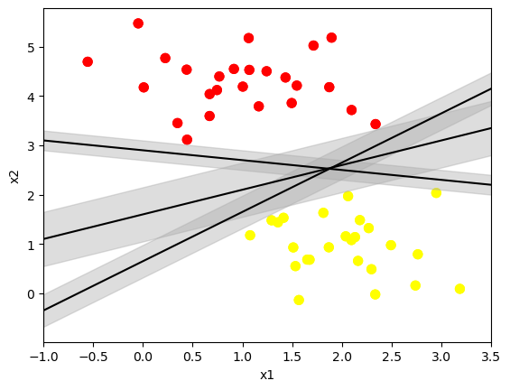
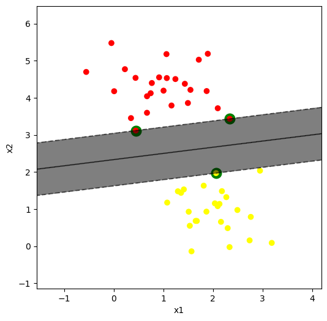
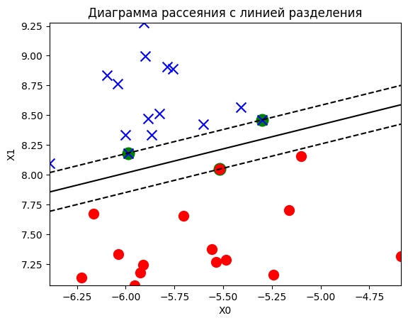
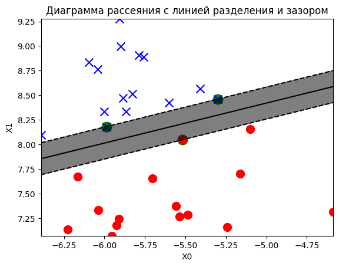
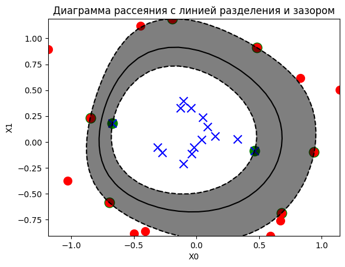
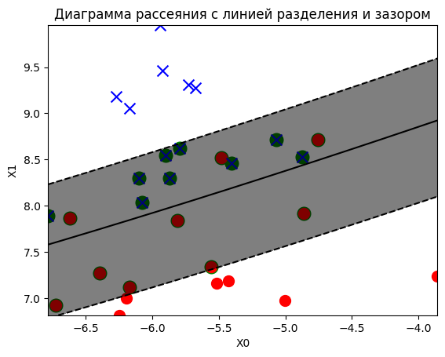

### Метод опорных векторов

#### Цель работы

Изучить работу метода опорных векторов для решения задач классификации и регрессии, познакомиться с основными особенностями и вариациями данного метода. Изучить соответствующие классы библиотеки sklearn, их параметры и атрибуты, применимые на практике.

#### Содержание работы

1. Сгенерируйте линейно разделимый датасет для классификации из двух признаков. Постройте на нем опорно-векторный классификатор без ядра с параметром С=100. Изобразите границу принятия решения и линию зазора на графике.
1. Сгенерируйте линейно неразделимый датасет с зазором между классами. Повторите виуальный анализ на нем.
1. Сгенерируйте неразделимый датасет так, чтобы классы пересекались. Повторите построение и оценку метода опорных векторов на нем.

#### Методические указания

Метод опорных векторов SVM (Support Vector Machines) — это алгоритм машинного обучения, используемый для решения задач классификации, регрессии и обнаружения выбросов. 

Рассмотрим подробно SVM для метода бинарной классификации (разделеня на два класса) в случае линейно разделимых и линейно неразделимых классов.

**Случай линейно разделимых классов** (т.е. таких, для которых возможно построить гиперплоскость в n-мерном пространстве для разделения объектов двух классов):
Модель SVM ищет гиперплоскость с максимальной шириной разделяющей полосы (margin), называемой линией зазора, то есть разделяющую гиперплоскость, максимально отдаленную от обоих классов.

Чтобы иметь возможность наглядной визуализации рассмотрим задачу на примере данных с двумя признаками. На рисунке ниже изображены различные варианты проведения разделяющей гиперплоскости (в данном случае прямой) с линией зазора.



Классификатор SVM устанавливает самую широкую, какую только возможно, полосу (представленную параллельными
пунктирными линиями на рисунке ниже) между классами.



Уравнения гиперплоскости и линий зазора имеют вид соответственно:

$<\vec{w} ;\vec{x} > + b = 0$

$<\vec{w} ;\vec{x} > + b = 1$

$<\vec{w} ;\vec{x} > + b = -1$

Оптимальные значения $\vec{w}$ и $b$ подбираются в результате решения задачи оптимизации, которая заключается в минимизации функции потерь и максимизации зазора между классами.

Метод опорных векторов, решает задачу оптимизации, подбирая прямую с максимальным зазором между ближайшими точками разных классов. Эти точки называются опорными векторами.

В библиотеке `Scikit-Learn` метод опорных векторов для классификации реализован в `sklearn.svm.SVC`. 
Для линейно разделимых данных можно использовать класс SVC с линейным ядром (`kenel = 'linear'`). Также в `Scikit-Learn` есть другая реализация метода опорных векторов для случая линейной разделимости данных `sklearn.svm.LinearSVC`, но в нём нет возможности выводить информацию об опорных векторах.

Классификация методом опорных векторов может осуществляться с *жёстким зазором* (hard margin classification) и с *мягким зазором* (soft margin classification). Разберёмcя, что это значит.

При классификации с *жестким зазором* все образцы должны находятся вне линии зазора. 

При классификацией с мягким зазором допускаются нарушения границы зазора, т.е. появления экземпляров, которые оказываются внутри полосы зазора или даже на неправильной стороне, отыскивается баланс между удержанием полосы как можно более широкой и ограничением количества нарушений зазора.

Классификация с жестким зазором  имеет недостатки. Во-первых, она работает, только если данные являются линейно разделимыми. Во-вторых, она довольно чувствительна к выбросам. Чтобы избежать таких проблем, предпочтительнее применять более гибкую модель. 

В классах `SVM` библиотеки `Scikit-Learn` можно управлять упомянутым балансом, используя гиперпараметр `C`: меньшее значение `C` ведет к более широкой полосе, но большему числу нарушений зазора, а чем больше `C`, тем более жёсткий зазор.

**Случай линейно неразделимых классов**:

В случае линейной неразделимости вводятся дополнительные переменные, характеризующие допустимую ошибку классификации на различных объектах, и применяется трюк, заключающийся в переходе от скалярного произведения к нелинейной функции ядра (kernel trick). Данный прием позволяет перейти в пространство большей размерности, где выборка может быть линейно разделена.

Рассмотрим три вида ядер:

1. *Линейное ядро* (kernel = 'linear' ) — это ядро, которое строит гиперплоскость для разделения данных. Оно часто используется в задачах с линейно разделимыми данными. В математическом смысле линейное ядро вычисляет скалярное произведение между векторами признаков объектов. Если объекты невозможно разделить линейной гиперплоскостью, то следует с этим ядром использовать классификацию с мягким зазором (soft margin), которая позволяет допустить ошибки классификации и при этом сохранить разделяющую гиперплоскость.

2. *Радиальное базисное ядро* (kernel = 'rbf') — это наиболее часто используемое ядро (установлено по умолчанию), которое может разделять данные, не являющиеся линейно разделимыми. Оно создает границу принятия решений в виде радиально-симметричного колокола.

3. *Ядро с полиномиальной функцией* (kernel = 'poly') — это ядро, которое вводит полиномиальную функцию в пространство признаков для разделения данных. Это может быть полезно для данных, которые не могут быть разделены гиперплоскостью.

Существуют и другие ядра, но они применяются гораздо реже.

Посмотрим, как работает данный метод на практике.

##### Линейно разделимые данные

Для самого простого случая сгенерируем линейноразделимый датасет. Для этого воспользуемся средствами библиотеки sklearn:

```py
X, y = make_blobs(n_features=2, n_samples=30, centers=2, random_state=5, cluster_std=0.4)
```

Изобразим получившийся датасет на графике:

```py
plt.scatter(X[:, 0][y==0], X[:, 1][y==0], marker="o", c='r', s=100)
plt.scatter(X[:, 0][y==1], X[:, 1][y==1], marker="x", c='b', s=100)

plt.title("Диаграмма рассеяния")
plt.xlabel('x0')
plt.ylabel('x1')
plt.show()
```

Мы должны получить похожую картину:


Вы можете использовать другие параметры при генерации. Главное убедиться, что получившийся датасет линейно разделим и меет зазор между классами. 

Теперь создадим и обучим модель классификации на основе метода опорных векторов (опорно-векторный классификатор). Обратите внимание, что мы используем высокое значение С для задания жесткого зазора между классами. Также мы должны явно указать вид используемой ядерной функции. Нам сейчас нужен классификатор с линейным ядром (без ядра):

```py
svm_linear = SVC(kernel='linear', C=100)
svm_linear.fit(X, y)
```

Уже знакомые нам поля класса (которые присутствуют и в объектах классов линейных моделей) выводят коэффициенты линейной функции, используемой как граница принятия решения:

```py
svm_linear.coef_
```

И также как в других моделях, свободный коэффициет указывается отдельно:

```py
svm_linear.intercept_
```

Эту информацию можно использовать для построения границы принятия решений. Изобразим границу принятия решения на графике:

```py
X0 = np.linspace(X[:, 0].min(),X[:, 0].max(), X.shape[0])

plt.plot(X0,-svm_linear.intercept_[0]/svm_linear.coef_[0][1]-svm_linear.coef_[0][0]/svm_linear.coef_[0][1]*X0, c='k')

plt.scatter(X[:, 0][y==0], X[:, 1][y==0], marker="o", c='r', s=100)
plt.scatter(X[:, 0][y==1], X[:, 1][y==1], marker="x", c='b', s=100)

plt.title("Диаграмма рассеяния c границей принятия решения")
plt.xlabel('X0')
plt.ylabel('X1')
plt.show()
```

Мы должны получить линейную границу:


Объект метода опорных векторов в sklearn содержит ряд специфических полей и методов, с помощью которых можно посмотреть информацию о том, какие именно вектора (точки исходной выборки) стали опорными. В частности, так можно вывести самии координаты опорных векторов:

```py
svm_linear.support_vectors_
```

А так - посмотреть индексы опорных векторов в исходном наборе данных:

```py
svm_linear.support_
```

Иногда бывает полезно узнать количество опорных векторов. Особенно в задачах множественной классификации, когда опорные вектора соответствуют разным классам. Для этого существует также специальное поле:

```py
svm_linear.n_support_
```

Используя эти данные можно визуализировать сами опорные вектора:

```py
plt.scatter(svm_linear.support_vectors_[:, 0],svm_linear.support_vectors_[:, 1], linewidth=7, facecolors='green')

plt.scatter(X[:, 0][y==0], X[:, 1][y==0], marker="o", c='r', s=100)
plt.scatter(X[:, 0][y==1], X[:, 1][y==1], marker="x", c='b', s=100)

plt.title("Диаграмма рассеяния c отмеченными опорными векторами")
plt.xlabel('x0')
plt.ylabel('x1')
plt.show()
```

Мы видим на графике, какие точки метод счел опорными:


Соответствует ли это вашему интуитивному пониманию опорных векторов?

Если отступить отграницы принятия решений расстояние, соответствующее росту функции на единицу в обе стороны мы получим границы области зазора. Давайте построим эту границу:

```py
plt.plot(X0,-svm_linear.intercept_[0]/svm_linear.coef_[0][1]-svm_linear.coef_[0][0]/svm_linear.coef_[0][1]*X0, c='k')

plt.plot(X0,(-svm_linear.intercept_[0]-1)/svm_linear.coef_[0][1]-svm_linear.coef_[0][0]/svm_linear.coef_[0][1]*X0,linestyle='--', c='k')
plt.plot(X0,(-svm_linear.intercept_[0]+1)/svm_linear.coef_[0][1]-svm_linear.coef_[0][0]/svm_linear.coef_[0][1]*X0,linestyle='--', c='k')

plt.scatter(svm_linear.support_vectors_[:, 0],svm_linear.support_vectors_[:, 1], linewidth=7, facecolors='green')

plt.scatter(X[:, 0][y==0], X[:, 1][y==0], marker="o", c='r', s=100)
plt.scatter(X[:, 0][y==1], X[:, 1][y==1], marker="x", c='b', s=100)

plt.title("Диаграмма рассеяния c линией разделения и линиями зазоров")
plt.xlabel('X0')
plt.ylabel('X1')
plt.show()
```

Мы видим, что граница принятия решения располагается ровно посередине зазора, а границы зазора проходят ровно через опорные вектора:


Но более правильно троить границу принятия решения как линии уровня на поверхности фукнции гипотезы::

```py
X0 = np.linspace(X[:, 0].min(), X[:, 0].max(), X.shape[0])
X1 = np.linspace(X[:, 1].min(), X[:, 1].max(), X.shape[0])

X0_grid, X1_grid = np.meshgrid(X0, X1)
Z = svm_linear.intercept_[0] + svm_linear.coef_[0][0] * X0_grid +  svm_linear.coef_[0][1] * X1_grid
plt.contour(X0_grid, X1_grid, Z, colors='k', levels=[-1, 0, 1], linestyles=['--', '-', '--'])

plt.scatter(svm_linear.support_vectors_[:, 0],svm_linear.support_vectors_[:, 1], linewidth=7, facecolors='green')

plt.scatter(X[:, 0][y==0], X[:, 1][y==0], marker="o", c='r', s=100)
plt.scatter(X[:, 0][y==1], X[:, 1][y==1], marker="x", c='b', s=100)

plt.title("Диаграмма рассеяния c линией разделения")
plt.xlabel('X0')
plt.ylabel('X1')
plt.show()
```

Мы получаем точно такой же график:



Такой код нам пригодится еще не раз, поэтому давайте оформим его в функцию:

```py
def plot_decision_regions(X, y, model):
    plt.scatter(model.support_vectors_[:, 0],model.support_vectors_[:, 1], linewidth=7, facecolors='green')

    plt.scatter(X[:, 0][y==0], X[:, 1][y==0], marker="o", c='r', s=100)
    plt.scatter(X[:, 0][y==1], X[:, 1][y==1], marker="x", c='b', s=100)

    X0 = np.linspace(X[:, 0].min(),X[:, 0].max(), X.shape[0])
    X1 = np.linspace(X[:, 1].min(),X[:, 1].max(), X.shape[0])

    X0_grid, X1_grid = np.meshgrid(X0, X1)
    Z = model.decision_function(np.array([X0_grid.ravel(), X1_grid.ravel()]).T).reshape(X0_grid.shape)
    plt.contour(X0_grid, X1_grid, Z, colors='k', levels=[-1, 0, 1], linestyles=['--', '-', '--'])
    plt.contourf(X0_grid, X1_grid, Z, colors='k', levels=[-1, 0, 1], alpha=0.5)

    plt.title("Диаграмма рассеяния c линией разделения и зазором")
    plt.xlabel('X0')
    plt.ylabel('X1')
    plt.show()
```

Проверим, как она работает:

Мы видим еще один почти такой же график:



Теперь нам осталось оценить качество модели классификации численно. Для этого вычислим вектор предсказанных значений целевой переменной:

```py
y_pred =  svm_linear.predict(X)
```

Используем его для вывода метрики точности:

```py
metrics.accuracy_score(y, y_pred)
```

```
1.0
```

И матрицы классификации:

```py
metrics.confusion_matrix(y, y_pred)
```

```
array([[15,  0],
       [ 0, 15]])
```

Проверим работу модели на новой точке. Создадим новую точку данных:

```py
observation_new = [[-5.25, 7.5]]
```

Ее можно изобразить вместе с изначальным датасетом и моделью:

```py
plt.scatter(observation_new[0][0], observation_new[0][1], marker='*', s=100, color='orange')
plot_decision_regions(X, y, svm_linear)
```


При помощи соответствующего метода класса найдет значение функции гипотезы в этой точке:

```py
svm_linear.decision_function(observation_new)
```

И конечно предсказание класса в ней же:

```py
svm_linear.predict(observation_new)
```


По результатам анализа видно, что построенная модель работает идеально. Но это только самый простой случай.

##### Линейно неразделимые данные с зазором

Для более сложного применения метода опорных векторов сгенерируем датасет совершенно другой формы:

```py
X, y = make_circles(n_samples=30, random_state=5, factor=.1, noise=.2)

plt.scatter(X[:, 0][y==0], X[:, 1][y==0], marker="o", c='r', s=100)
plt.scatter(X[:, 0][y==1], X[:, 1][y==1], marker="x", c='b', s=100)

plt.title("Диаграмма рассеяния")
plt.xlabel('X0')
plt.ylabel('X1')
plt.show()
```

Он должен выглядеть примерно так:


Для этого набора данных воспользуемся методом опорных векторов в гауссовым ядром:

```py
svm_rbf = SVC(kernel='rbf', C=100).fit(X, y)
```

Выведем данные об опорных векторах:

```py
svm_rbf.n_support_
svm_rbf.support_
svm_rbf.support_vectors_
```

И построим данную модель на графике:

```py
plot_decision_regions(X, y, svm_rbf)
```

На графике мы видим, как располагаются опорные вектора, граница принятия решения и полоса зазора:



Здесь ясно видно, что за счет применения другой функции ядра, по сути - другой метрики расстояния между точками, граница принятия решения изгибается определенным образом. Но опорные вектора, как всегда - это наиболее близкие к другому классу точки. Только теперь расстояние (точнее, мера близости рассчитывается по-другому).

Посчитаем метрики данной модели:

```py
metrics.accuracy_score(y, y_pred)
metrics.confusion_matrix(y, y_pred)
```

Какой можно сделать вывод о качестве ее работы?

##### Данные без зазора

Как будет себя вести метод опорных векторов, если в данных между классами вообще нет никакого зазора? Давайте сгенерируем такой набор данных и посмотрим:

```py
X, y = make_blobs(n_features=2, n_samples=30, centers=2, random_state=5, cluster_std=0.7)

plt.scatter(X[:, 0][y==0], X[:, 1][y==0], marker="o", c='r', s=100)
plt.scatter(X[:, 0][y==1], X[:, 1][y==1], marker="x", c='b', s=100)

plt.title("Диаграмма рассеяния")
plt.xlabel('X0')
plt.ylabel('X1')
plt.show()
```


На диаграмме мы видим, что классы как бы "перемешиваются", никакого зазора между ними нет. В таком случае, нам нужно применить метод опорных векторов с так называемым мягким зазором. Это достигается уменьшением параметра регуляризации (С):

```py
svm_poly = SVC(kernel='poly', degree=4, C=2).fit(X, y)
```

Построим данную модель на графике:

```py
plot_decision_regions(X, y, svm_poly)
```

Мы видим довольно широкую полосу зазора:



Но самое главное, что уменьшение регуляризации модели приводит к тому, что модель допускает некоторые погрешности в попадании точек в полосу зазора. За счет этого, модель все-таки формирует оптимальную разделяющую прямую.

Но при этом опорными векторами станут гораздо больше точек:

```py
svm_poly.n_support_
```

```
array([9, 9], dtype=int32)
```

Можно сделать вывод, что чем меньше зазор между классами, тем менее эффективен метод опорных векторов.

Также, как и в предыдущих заданиях, выведем значение метрик для данной модели:

```py
metrics.accuracy_score(y, y_pred)
metrics.confusion_matrix(y, y_pred)
```

```
array([[12,  3],
       [ 0, 15]])
```

Можно сделать вывод, что данная модель, хоть и не идеальная, все же довольно точно справляется с классификацией.

#### Задания для самостоятельного выполнения

1. В первом задании поэкспериментируйте с различными значениями аргумента C класса SVC. Сделайте вывод о том, как он влияет на модель классификации.
1. В первом задании подвигайте точку нового предсказания. Убедитесь, что с другой стороны границы предсказывается другой класс. Как изменяется предсказание, если точка ляжет внутрь полосы зазора?
1. Во втором задании повторите анализ с методом опорных векторов с другими видами ядер. Сравните вид границы принятия решения и показатели точности модели. 
1. В третьем задании поэкспериментируйте со значением аргумента C. Сделайтевывод о том, как он влияет на модель. 
1. В третьем задании примените классификатор без ядра. Познакомьтесь и примените класс Linear_SVC. 
1. Сгенерируйте датасет для классификации из 1000 точек и 5 атрибутов. Попробуйте применить метод опорных векторов на нем. Найдите методом подбора наилучшее ядро и значение С.
1. Попробуйте данную модель с большим количеством точек. На каком количестве обучение начинает занимать существенное время?
1. Примените метод опорных векторов для задачи множественной классификации. Самостоятельно сгенерируйте визуализируемый датасет для этой задачи. Поробуйте изобразить границу принятия решений и зазор.
2. Выберите из библиотеки sklearn готовый датасет для классификации и попробуйте смоделировать его при помощи метода опорных векторов.
3. Повторите такой же анализ для задачи регрессии и соответствующего датасета.

#### Контрольные вопросы

1. Чем отличается класс SVC и LinearSVC в библиотеке sklearn при использовании метода опорных векторов без ядра?
1. Чем отличается метод опорных векторов с разными ядрами? Как выбор функции ядра влияет на форму границы принятия решения?
2. Как метод опорных векторов работает в задачах множественной классификации?
3. Как метод опорных векторов может быть использован для решения задачи регрессии?

#### Дополнительные задания

1. Сделайте рефакторинг кода, рисующего график границы принятия решения и зазора для метода опорных векторов.
1. Замерьте зависимость времени обучения метода опорных векторов от количества точек в датасете. Сделайте это для разных типов ядер. Представьте результаты наглядно.
1. Для последних двух заданий из самостояельных сравните производительность метода опорных векторов и других методов классификации. 

