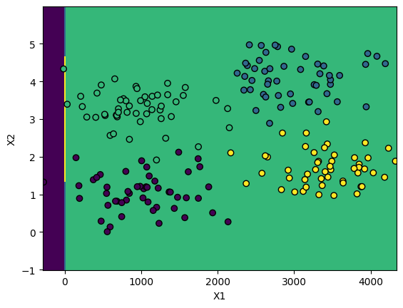
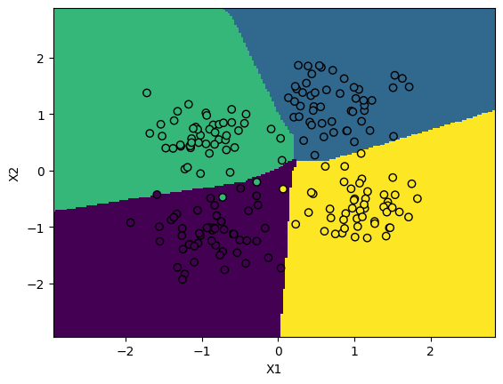
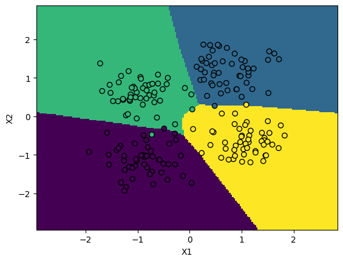

### Метод опорных векторов

#### Цель работы

Познакомиться с перцептроном как с моделью обучения с учителем в библиотеке sklearn.

#### Содержание работы

1. Сгенерируйте данные и обучите на них модель перцептрона.
1. Просмотрите параметры модели, визуализируйте и улучшите ее работу.

#### Методические указания

Для тренировки работы с перцептроном создадим набор данных. Воспользуемся уже знакомыми функциями генерации данных. Сразу после создания визуализируем этот набор данных на диаграмме рассеяния:

```py
blob_centers = ([1, 1], [3, 4], [1, 3.3], [3.5, 1.8])
X, y = make_blobs(n_samples=200, 
                          centers=blob_centers, 
                          cluster_std=0.5,
                          random_state=0)

X[:, 0] *= 1000

plt.scatter(X[:, 0], X[:, 1], c=y,  edgecolors='black',linewidth=1)
```

Вы должны увидеть набор данных, состоящий из четырех кластеров, принадлежащий четырем классам:


То есть мы имеем дело с задачей множественной классификации. Для перцептрона это не проблема, нейросеть это очень универсальная модель, она может работать нативно и в множественном режиме. Давайте создадим первую версию нашей нейросети:

```py
clf = MLPClassifier(hidden_layer_sizes=(6,), 
                    random_state=1).fit(X, y)
```

Обратите внимание, что при создании мы задаем количество слоев и количество нейронов в каждом из них с помощью кортежа _hidden\_layer\_sizes_. В данном случае имеем один скрытый слой в 6 нейронов. Если мы не зададим этот аргумент, то его значение по умолчанию - (100,), то есть один слой со ста нейронами. Этого для первой моедли будет довольно много.

Так как мы уже обучили модель, мы можем посмотреть значения весов нейронов, то есть внутренние параметры нейросети. Все они хранятся в поле _coefs\__, аналогично другим моделям машинного обучения в sklearn. Например, можно вывести веса отдельно для каждого слоя:

```py
print("Веса между входным и скрытым слоем:")
print(clf.coefs_[0])
print("\nВеса между скрытым и выходным слоем:")
print(clf.coefs_[1])
```

```
Веса между входным и скрытым слоем:
[[-0.13186096  0.36276684 -0.87753229 -0.3544923  -0.62342741 -0.69458326]
 [-0.55527141 -0.28633324 -0.1793465   0.07807555 -0.14370807  0.32689274]]

Веса между скрытым и выходным слоем:
[[-0.4955391  -0.41463226  0.41301641  0.65040935 -0.25197168  0.26165608]
 [ 0.5134373   0.53925562 -0.57325313 -0.6379063  -0.4542433   0.51596208]
 [-0.55456344 -0.10522807  0.63360879  0.03543427  0.28300565 -0.25076137]
 [ 0.25356345  0.4604906  -0.66711811  0.3423877   0.70293671  0.33948522]
 [-0.29956981  0.3969661  -0.54770982 -0.0851425   0.58948128 -0.28122352]
 [-0.28935468 -0.51007606 -0.6656005   0.24156416 -0.39625967 -0.3203444 ]]
```

Либо по каждому нейрону отдельно:

```py
for i in range(len(clf.coefs_)):
    number_neurons_in_layer = clf.coefs_[i].shape[1]
    for j in range(number_neurons_in_layer):
        weights = clf.coefs_[i][:,j]
        print(i, j, weights, end=", ")
        print()
    print()
```

```
0 0 [-0.09809877 -0.58903611], 
0 1 [ 0.33667051 -0.31219238], 
0 2 [-0.82024119 -0.22424296], 
0 3 [-0.29720839  0.11423652], 
0 4 [-0.56852789 -0.18324369], 
0 5 [-0.66056109  0.37321781], 

1 0 [-0.51316658 -0.24370005 -0.59713359 -0.5769702   0.34285864 -0.7006119 ], 
1 1 [-0.43365467  0.34328608 -0.67678056 -0.10221922 -0.25645017  0.35515533], 
1 2 [ 0.43189995  0.57835494 -0.46609801  0.75476969  0.33417991  0.80295119], 
1 3 [0.68148414 0.57889271 0.54011704 0.00610289 0.47281254 0.33880635], 
```

Обратите внимание, что судя по выведенной информации, на выходном слое у нас четыре нейрона. Это обусловлено тем, что в датасете четыре класса. Количество классов всегда определяет количество нейронов на выходном слое. А на входном слое у нас два нейрона. Это потому, что в датасете всего две атрибута.

Веса нейронов смещения (bias) как и в других моделях хранятся в отдельном поле:

```py
print("Веса смещения для скрытого слоя:")
print(clf.intercepts_[0])
print("\nВеса смещения для выходного слоя:")
print(clf.intercepts_[1])
```

```
Веса смещения для скрытого слоя:
[-0.55752645  0.60978582 -0.8640854   0.33258994 -0.18652436  0.05696655]

Веса смещения для выходного слоя:
[-0.29413473  0.49414359 -0.60792984 -0.11888525]
```

Давайте проанализируем, насколько хорошо работает наша модель. Для этого воспользуемся уже знакомой матрицей классификации:

```py
confusion_matrix(y, clf.predict(X))
```

```
array([[ 1,  0, 49,  0],
       [ 0,  0, 50,  0],
       [ 1,  0, 49,  0],
       [ 0,  0, 50,  0]])
```

Мы видим, что как будто модель работает не совсем корректно и делает много ошибок. Чтобы убедиться в этом, изобразим классификацию на графике:

```py
X0 = np.linspace(X[:, 0].min()-1,X[:, 0].max()+1, X.shape[0])
X1 = np.linspace(X[:, 1].min()-1,X[:, 1].max()+1, X.shape[0])
X0_grid, X1_grid = np.meshgrid(X0, X1)

y_predict = clf.predict(np.c_[X0_grid.ravel(),X1_grid.ravel()]).reshape(X0_grid.shape)
plt.pcolormesh(X0_grid, X1_grid, y_predict)

plt.scatter(X[:, 0], X[:, 1], c=y,  edgecolors='black',linewidth=1)
plt.xlabel('X1')
plt.ylabel('X2')
plt.show()
```

На примере данного кода познакомьтесь со способом изображения границы принятия решений для множественной классификации. Мы видим довольно странную картину:



Почти все точки модель относит к одному классу. А граница принятия решений почти всегда вертикальна. Что мы сделали не так? Для ответа на этот вопрос надо обратить внимание на подпись осей координат. Дело в том, что атрибуты в исходных данных имеют очень разные значения. $X_1$ измеряется в тысячах, а $X_2$ - в единицах. Это может стать проблемой для неекоторых моделей машинного обучения. И перцептрон - одна из них. Для корректной работы перцептрона данные нужно обязательно нормализовать. 

Для этого импортируем и воспользуемся объектом нормализации данных. Наример, таким:

```py
from sklearn.preprocessing import StandardScaler 
X_scaled = scaler.transform(X)
X_scaled = scaler.transform(X)
```

Давайте еще раз изобразим точки на графике, чтобы понять, как нормализация преобразовала наш датасет:


Само распределение как будто не изменилось, но обратите внимание на значения по осям. Теперь наш датасет имеет одинаковую размерность. Данные как будто "ужались" по горизонтали. Давайте посмотрим, повлияет ли это на качество обучения. Переобучим модель и выведем матрицу классификации:

```
array([[22,  0, 11, 17],
       [ 0, 38,  0, 12],
       [ 0,  3, 45,  2],
       [ 0,  5,  0, 45]])
```

Мы видим совершенно другую картину. Стало значительно лучше. Для большей уверенности изобразим классификацию на графике:


Мы видим, что регионы сооветствующих классов уже гораздо ближе к точкам обучающей выборки. При этом модель все еще делает довольно много ошибок. Как можно просто ее улучшить? вы могли обратить внимание, что при обучении модель выдавал предупреждение о раннем прерывании обучения. Мы уже сталкивались с такой ситуацией. Можно просто увеличить лимит итераций алгоритма обучения:

```py
clf = MLPClassifier(hidden_layer_sizes=(6,), max_iter=10_000, verbose=True).fit(X_scaled, y)
```

Заодно здесь мы применим еще один аргумент конструктора объекта перцептрона - _verbose_. Он позволяет вывести подробную информацию про обучение модели. Проанализируйте полученную информацию и сделайте вывод.

Теперь можно вывести матрицу классификации. Сразу видно, что опять стало значительно лучше:

```
array([[50,  0,  0,  0],
       [ 0, 50,  0,  0],
       [ 2,  3, 45,  0],
       [ 0,  1,  0, 49]])
```

Этот вывод подтверждает и визуализация модели:



Для дальнейшего повышения точности можно увеличить количество скрытых слоев. Тогда получится уже глубокая нейросеть. Например, обучим перцептрон с тремя слоями:

```py
clf = MLPClassifier(hidden_layer_sizes=(6, 6, 6), max_iter=10_000).fit(X_scaled, y)
```



Из графика видно, что граница принятия решений еще больше соответствует обучающей выборке. Постройте матрицу классификации этой модели самостоятельно.


#### Задания для самостоятельного выполнения

1. Создайте однослойный перцептрон с 1, 2, 10 и 100 нейронами. Сравние их точность и сделайте вывод о достаточном количестве нейронов.
1. Создайте и оцените модель с двумя, тремя и десятью скрытыми слоями с одинаковым количеством нейронов. Сравните их точность и сделайте вывод о достаточном количестве слоев.
1. Для глубокой модели выведите веса всех нейронов на всех слоях. Выведите значения векторов весов смещения.
1. Постройте и оцените модель с большим количеством нейронов и слоев. Замерьте время выполнения обучения, сравните со временем обучения более простых моделей.
1. Постройте и оцените модель классификации с помощью перцептрона на датасете, который вы использовали на контрольной по классификиации (если вы ее не выполняли, возьмите любой датасет из раздела "real world datasets" в библиотеке sklearn).
1. Постройте и оцените модель регрессии с помощью перцептрона на датасете, который вы использовали на контрольной по регрессии. 


#### Контрольные вопросы

1. Что называют глубокой нейронной сетью?
1. Что такое архитектура нейронной сети?
1. Как количество нейронов и слоев влияет на качество моделирования?
1. Как нейронная сеть решает задачи множественной классификации?
1. В каких случаях следует применять перцептрон?

#### Дополнительные задания

1. Повторите моделирование на одном из датасетов, но с использованием библиотек Tensoflow, PyTorch или Keras. Сравните результаты с реализацией перцептрона в библиотеке sklearn.
1. Поэкспериментируйте с разными функциями активации и методами оптимизации. Найдите датасеты, на которых лучше работают разные функции активации и методы оптимизации.

