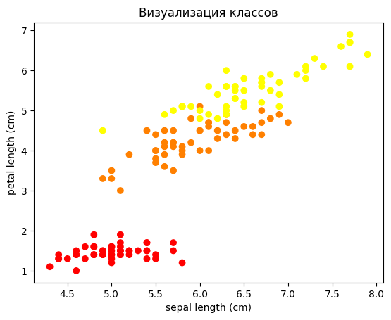
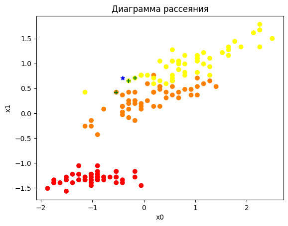

### Метод K блиайших соседей

#### Цель работы

Изучить работу класса KNeighborsClassifier библиотеки Scikit-Learn, реализующего метод K ближайших соседей для классификации.

#### Содержание работы

1. Загрузить датасет "Ирисы" и выбрать в обучающую выборку только первый и третий столбцы в качестве признаков.
1. Проведите минимаксную нормализацию данных.
1. Посроить модель классификации по методу ближайших соседей с k=3 и оценить эффективность этой модели.
1. Создать новое наблюдение, шкалировать его и сделать предсказание на нём. Вывести расстояния до трёх ближайших соседей. Вывести индексы и координаты трёх ближайших соседей. Визуализировать их.

#### Методические указания

Для рассмотрения метода ближайших соседей возьмем набор данных "Ирисы", встроенный в библиотеку sklearn. Загрузим данные:

```py
iris = load_iris() 
features = iris.data

data = pd.DataFrame(features, columns = iris.feature_names)
data.head()
```

В этом наборе данных четыре атрибута - характеристики различных растений. Для более точной классификации может понадобиться использовать все имеющиеся данные. Но для визуализации процесса классификации выберем только два столбца. В данном примере возьмем первый и третий столбцы - длину чашелистика и длины лепестка соответственно:

```py
X = data.iloc[:, [0, 2]]
y = iris.target
X.shape, y.shape
```

Визуалиируем данные по классам:

```py
plt.scatter(X.iloc[:, 0], X.iloc[:, 1], c=y, cmap='autumn')

plt.title("Визуализация классов")
plt.xlabel('sepal length (cm)')
plt.ylabel('petal length (cm)')
plt.show()
```



Мы имеем задачу множественной классификации с тремя классами - различными видами ирисов. 

Для применения метода ближайших соседей данные обязательно нужно нормализовать. Ранее в других работах мы пользовались объектом StandartScaler, который приводит распределение каждого признака к стандартному виду. Сейчас же для иллюстрации разных видов нормализации воспользуемся другим объектом - MinMaxScaler, который производит минимаксную нормализацию. Работа с этим объектом полностью аналогична:

```py
from sklearn.preprocessing import MinMaxScaler
scaler = MinMaxScaler()
X_scaled = scaler.fit_transform(X)
```

При визуализации нормализованного датасета видим следующую картину:


Взаимное расположение точек не изменилось, но все значения по обеим осям масштабированы таким образом, чтобы занимать интервал от 0 до 1. Такие данные уже можно использовать для построения метода ближайших соседей.

Для построения модели создадим объект, обучим его на нашем наборе данных (обратите внимание, что мы используем нормализованный вариант данных) и сделаем предсказание:

```py
from sklearn.neighbors import KNeighborsClassifier 

knn = KNeighborsClassifier(n_neighbors=3)
knn.fit(X_scaled, y)

y_pred = knn.predict(X_scaled)
```

Для оценки качества работы полученной модели выведем матрицу классификации:

```py
plt.title("Матрица классификации")
sns.heatmap(confusion_matrix(y, y_pred), annot=True, fmt ='d')
plt.ylabel('Действительные значения')
plt.xlabel('Предсказанные значения')
plt.show()
```

Получаем такую матрицу:


Мы видим, что в целом модель работает очень адекватно, из 150 точек неправильно распознает всего шесть. При этом, модель путает только второй и третий классы между собой. Первый класс модель всегда определяет безошибочно. Дополнительно мы можем вывести метрики качества множественной классификации в отчете о классификации:

```py
print(classification_report(y_pred, y))
```

Мы получим следующий результат:

```py
              precision    recall  f1-score   support

           0       1.00      1.00      1.00        50
           1       0.94      0.94      0.94        50
           2       0.94      0.94      0.94        50

    accuracy                           0.96       150
   macro avg       0.96      0.96      0.96       150
weighted avg       0.96      0.96      0.96       150
```

Здесь мы видим, что в целом наша модель имеет 96% точности, что свидетельствует о ее высоком качестве.

Теперь попробуем визуализировать области классификации, то есть построить границы принятия решений. Для этого, как и в предыдущих работах, будем использовать контурный график. Подготовим данные:

```py
X0 = np.linspace(X.iloc[:, 0].min()-1,X.iloc[:, 0].max()+1, X.shape[0])
X1 = np.linspace(X.iloc[:, 1].min()-1,X.iloc[:, 1].max()+1, X.shape[0])

X0_grid, X1_grid = np.meshgrid(X0, X1)

XX = np.array([X0_grid.ravel(), X1_grid.ravel()]).T
```

Обратите внимание, что мы для подготовки равномерной сетки используем исходный датасет, а ненормированный. Дело в том, что мы хотим построить график в пространстве исходных признаков, а не в искаженном масштабе нормализованных данных. Но для выполнения предсказания эти сгенерированные данные тоже нужно будет нормализовать:

```py
XX_scaled = scaler.transform(XX)
Z = knn.predict(XX_scaled).reshape(X0_grid.shape)
```

При этом важно, чтобы вы использовали именно тот же объект нормализации, который обучили на исходном датасете. Дело в том, что для данной модели теперь нужно будет использовать именно те параметры нормализации, которые были подобраны (или вычислены) по исходной выборке. После нормализации и получения предсказания можно строить графики:

```py
plt.scatter(X.iloc[:, 0], X.iloc[:, 1], c=y, cmap='autumn')
plt.contourf(X0_grid, X1_grid, Z, cmap='autumn', alpha=0.2)

plt.xlabel('sepal length (cm)')
plt.ylabel('petal length (cm)')
plt.title("Диаграмма рассеяния с областями классификации")
plt.show()
```

Мы должны получить примерно такую картину:


Теперь создадим новое наблюдение (новый объект), которое мы хотим классифицировать:

```py
observation_new = [[5.5, 5]]
```

Перед передачей его в модель машинного обучения его также обязательно нужно нормализовать:

```py
observation_new_scaled = scaler.transform(observation_new)
```

Очень просто можно посмотреть, к какому классу модель относит данный объект:

```py
knn.predict(observation_new_scaled)
```

Также соответствующий метод объекта модели позволит увидеть вероятности отнесения данного объекта к каждому классу модели:

```py
knn.predict_proba(observation_new_scaled)
```

Эти методы устроены точно также, как и в других моделях библиотеки sklearn. А вот специфическое поведение модели ближайших соседей - данный объект позволяет увидеть, какие объекты обучающей выборки модель нашла как ближайшие к новому:

```py
distances, indices = knn.kneighbors(observation_new_scaled)
```

Используя эти данные, очень просто можно визуализировать ближайших соседей к заданной точке на графике:

```py
plt.scatter(X_scaled[:, 0], X_scaled[:, 1], c=y, cmap='autumn')

plt.scatter(observation_new_scaled[0][0], observation_new_scaled[0][1], marker='*', color='b')

plt.scatter(X_scaled[indices[0]][0][0], X_scaled[indices[0]][0][1], marker='+', color='g')
plt.scatter(X_scaled[indices[0]][1][0], X_scaled[indices[0]][1][1], marker='+', color='g')
plt.scatter(X_scaled[indices[0]][2][0], X_scaled[indices[0]][2][1], marker='+', color='g')

plt.title("Диаграмма рассеяния")
plt.xlabel('sepal length (cm)')
plt.ylabel('petal length (cm)')
plt.show()
```



#### Задания для самостоятельного выполнения

1. Постройте последний график методических указаний в исходном пространстве признаков.
1. Попробуйте обучить модель с другим значением k. Визуализируйте области классификации и сравните эффективности модели.
1. Подвигайте новое наблюдение в последнем пункте методических указаний. Сдвиньте его за пределы области определения выборки. Как меняется нормализованное значение?
1. Поэкспериментируйте с разными метриками расстояния. Визуализируйте ближайших соседей нового объекта при разных метриках расстояния.
1. Обучите модель на полном датасете. Сравните ее эффективность с описанной в методических указаниях. Попробуйте разные значения k. 
1. Попробуйте в модели на полном датасете взвешенный алгоритм (аргумент weights объекта KNeighborsClassifier). Сравние его точность с равномерным вариантом.
1. Постройте график точности (accuracy) модели в зависимости от значения k. Сделайте вывод.
1. Выберите датасет и постройте регрессию при помощи метода ближайших соседей.


#### Контрольные вопросы

1. Чем отличается стандартизация и манимаксная нормализация данных? Есть ли другие методы нормализации данных? Когда следует применять какие методы?
1. В чем смысл параметра k в алгоритме ближацших соседей? Как его выбирать?
1. Чем отличается взвешенный и равномерный вариант метода ближайших соседей? Когда применять какой?
1. Почему нормализованное по минимаксному методу значение может быть больше ?
1. Что такое метрики расстояния и как они влияют на работу метода ближайших соседей?

#### Дополнительные задания

1. Создайте интерактивный график, на котором можно в режиме реального времени менять положение точки, соответствующей новому наблюдению. График должен анимированно визуализировать ближайших соседей этой точки.
1. Модифицируйтеанимацию из предыдущего задания так, чтобы можно было менять количество ближайших соседей, метрику расстояния.


