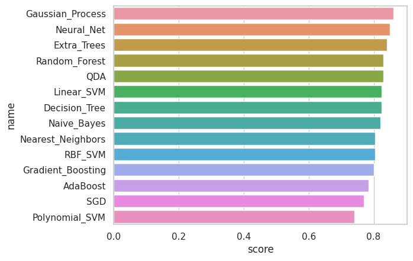

### Оптимизация гиперпараметров

#### Цель работы

Познакомиться с оптимизацией гиперпараметров

#### Содержание работы

1. Сгенерировать датасет для задачи бинарной классификации с использованием функции make_classification.
2. Построить и оценить качество различных моделей классификации, используя метрики accuracy и F1-score.
5. Построить модель elasticnet на данных прогнозирования продаж.
6. Оптимизировать гиперпараметры данной модели с помощью поиска по сетке.

#### Методические указания

##### Простой выбор модели

Загрузим необходимые библиотеки:


```python
import numpy as np
import pandas as pd
import matplotlib.pyplot as plt
import seaborn as sns
```

Сгенерируем матрицу признаков и вектор целей для задачи классификации. Для этого воспользуемся библиотечной функцией make_classification, которая генерирует случайное распределение по заданным параметрам. Число генерируемых точек данных зададим равным 1000, количество признаков - 5. Классов у нас  будет два. 


```python
from sklearn.datasets import make_classification
X, Y = make_classification(n_samples=1000, n_classes=2, n_features=5, n_redundant=0, random_state=1)
```

Выведем количественные параметры датаета:


```python
X.shape, Y.shape
```

```
    ((1000, 5), (1000,))
```


В датасете описаны 1000 объектов и у каждого есть 5 признаков. 

Разделим данные на обучающую и тестовую части:


```python
from sklearn.model_selection import train_test_split
X_train, X_test, Y_train, Y_test = train_test_split(X, Y, test_size=0.2)
```

Выведем количественные параметры тестовой и обучающей выборки:


```python
X_train.shape, Y_train.shape
```


```
    ((800, 5), (800,))
```


```python
X_test.shape, Y_test.shape
```


```
    ((200, 5), (200,))
```


Можем приступать к созданию и обучению модели. Импортируем нужные объекты из библиотеки scikit-learn. В данном случае мы будем импортировать модели классифиции. 


```python
import pandas as pd

from sklearn.neural_network import MLPClassifier
from sklearn.neighbors import KNeighborsClassifier
from sklearn.svm import SVC
from sklearn.gaussian_process import GaussianProcessClassifier
from sklearn.ensemble import GradientBoostingClassifier
from sklearn.gaussian_process.kernels import RBF
from sklearn.tree import DecisionTreeClassifier
from sklearn.ensemble import ExtraTreesClassifier
from sklearn.ensemble import RandomForestClassifier, AdaBoostClassifier
from sklearn.naive_bayes import GaussianNB
from sklearn.discriminant_analysis import QuadraticDiscriminantAnalysis
from sklearn.linear_model import SGDClassifier
```

Построение различных моделей классификации


```python
names = ["Nearest_Neighbors", "Linear_SVM", "Polynomial_SVM", "RBF_SVM", "Gaussian_Process",
         "Gradient_Boosting", "Decision_Tree", "Extra_Trees", "Random_Forest", "Neural_Net", "AdaBoost",
         "Naive_Bayes", "QDA", "SGD"]

classifiers = [
    KNeighborsClassifier(3),
    SVC(kernel="linear", C=0.025),
    SVC(kernel="poly", degree=3, C=0.025),
    SVC(kernel="rbf", C=1, gamma=2),
    GaussianProcessClassifier(1.0 * RBF(1.0)),
    GradientBoostingClassifier(n_estimators=100, learning_rate=1.0),
    DecisionTreeClassifier(max_depth=5),
    ExtraTreesClassifier(n_estimators=10, min_samples_split=2),
    RandomForestClassifier(max_depth=5, n_estimators=100),
    MLPClassifier(alpha=1, max_iter=1000),
    AdaBoostClassifier(n_estimators=100),
    GaussianNB(),
    QuadraticDiscriminantAnalysis(),
    SGDClassifier(loss="hinge", penalty="l2")]
```

Необходимо сравнить модели друг с другом и выбрать наиболее точные. Обучим модель, примените модель к тестовым данным и запишите показатели точности.


```python
scores = []
for name, clf in zip(names, classifiers):
    clf.fit(X_train, Y_train)
    score = clf.score(X_test, Y_test)
    scores.append(score)
```

Анализ производительности модели


```python
import pandas as pd
import seaborn as sns
```

Сформируем DataFrame для наглядного отображения показателя точности


```python
df = pd.DataFrame()
df['name'] = names
df['score'] = scores
df.sort_values(by=["score"], ascending=False, inplace=True)
df
```


<table border="1" class="dataframe">
  <thead>
    <tr style="text-align: right;">
      <th></th>
      <th>name</th>
      <th>score</th>
    </tr>
  </thead>
  <tbody>
    <tr>
      <th>4</th>
      <td>Gaussian_Process</td>
      <td>0.860</td>
    </tr>
    <tr>
      <th>9</th>
      <td>Neural_Net</td>
      <td>0.850</td>
    </tr>
    <tr>
      <th>7</th>
      <td>Extra_Trees</td>
      <td>0.840</td>
    </tr>
    <tr>
      <th>8</th>
      <td>Random_Forest</td>
      <td>0.830</td>
    </tr>
    <tr>
      <th>12</th>
      <td>QDA</td>
      <td>0.830</td>
    </tr>
    <tr>
      <th>1</th>
      <td>Linear_SVM</td>
      <td>0.825</td>
    </tr>
    <tr>
      <th>6</th>
      <td>Decision_Tree</td>
      <td>0.825</td>
    </tr>
    <tr>
      <th>11</th>
      <td>Naive_Bayes</td>
      <td>0.820</td>
    </tr>
    <tr>
      <th>0</th>
      <td>Nearest_Neighbors</td>
      <td>0.805</td>
    </tr>
    <tr>
      <th>3</th>
      <td>RBF_SVM</td>
      <td>0.805</td>
    </tr>
    <tr>
      <th>5</th>
      <td>Gradient_Boosting</td>
      <td>0.800</td>
    </tr>
    <tr>
      <th>10</th>
      <td>AdaBoost</td>
      <td>0.785</td>
    </tr>
    <tr>
      <th>13</th>
      <td>SGD</td>
      <td>0.770</td>
    </tr>
    <tr>
      <th>2</th>
      <td>Polynomial_SVM</td>
      <td>0.740</td>
    </tr>
  </tbody>
</table>
  

Добавление цветов во фрейм данных


```python
cm = sns.light_palette("green", as_cmap=True)
s = df.style.background_gradient(cmap=cm)
s
```

<table id="T_c3bf0" class="dataframe">
  <thead>
    <tr>
      <th class="blank level0" >&nbsp;</th>
      <th id="T_c3bf0_level0_col0" class="col_heading level0 col0" >name</th>
      <th id="T_c3bf0_level0_col1" class="col_heading level0 col1" >score</th>
    </tr>
  </thead>
  <tbody>
    <tr>
      <th id="T_c3bf0_level0_row0" class="row_heading level0 row0" >4</th>
      <td id="T_c3bf0_row0_col0" class="data row0 col0" >Gaussian_Process</td>
      <td id="T_c3bf0_row0_col1" class="data row0 col1" >0.860000</td>
    </tr>
    <tr>
      <th id="T_c3bf0_level0_row1" class="row_heading level0 row1" >9</th>
      <td id="T_c3bf0_row1_col0" class="data row1 col0" >Neural_Net</td>
      <td id="T_c3bf0_row1_col1" class="data row1 col1" >0.850000</td>
    </tr>
    <tr>
      <th id="T_c3bf0_level0_row2" class="row_heading level0 row2" >7</th>
      <td id="T_c3bf0_row2_col0" class="data row2 col0" >Extra_Trees</td>
      <td id="T_c3bf0_row2_col1" class="data row2 col1" >0.840000</td>
    </tr>
    <tr>
      <th id="T_c3bf0_level0_row3" class="row_heading level0 row3" >8</th>
      <td id="T_c3bf0_row3_col0" class="data row3 col0" >Random_Forest</td>
      <td id="T_c3bf0_row3_col1" class="data row3 col1" >0.830000</td>
    </tr>
    <tr>
      <th id="T_c3bf0_level0_row4" class="row_heading level0 row4" >12</th>
      <td id="T_c3bf0_row4_col0" class="data row4 col0" >QDA</td>
      <td id="T_c3bf0_row4_col1" class="data row4 col1" >0.830000</td>
    </tr>
    <tr>
      <th id="T_c3bf0_level0_row5" class="row_heading level0 row5" >1</th>
      <td id="T_c3bf0_row5_col0" class="data row5 col0" >Linear_SVM</td>
      <td id="T_c3bf0_row5_col1" class="data row5 col1" >0.825000</td>
    </tr>
    <tr>
      <th id="T_c3bf0_level0_row6" class="row_heading level0 row6" >6</th>
      <td id="T_c3bf0_row6_col0" class="data row6 col0" >Decision_Tree</td>
      <td id="T_c3bf0_row6_col1" class="data row6 col1" >0.825000</td>
    </tr>
    <tr>
      <th id="T_c3bf0_level0_row7" class="row_heading level0 row7" >11</th>
      <td id="T_c3bf0_row7_col0" class="data row7 col0" >Naive_Bayes</td>
      <td id="T_c3bf0_row7_col1" class="data row7 col1" >0.820000</td>
    </tr>
    <tr>
      <th id="T_c3bf0_level0_row8" class="row_heading level0 row8" >0</th>
      <td id="T_c3bf0_row8_col0" class="data row8 col0" >Nearest_Neighbors</td>
      <td id="T_c3bf0_row8_col1" class="data row8 col1" >0.805000</td>
    </tr>
    <tr>
      <th id="T_c3bf0_level0_row9" class="row_heading level0 row9" >3</th>
      <td id="T_c3bf0_row9_col0" class="data row9 col0" >RBF_SVM</td>
      <td id="T_c3bf0_row9_col1" class="data row9 col1" >0.805000</td>
    </tr>
    <tr>
      <th id="T_c3bf0_level0_row10" class="row_heading level0 row10" >5</th>
      <td id="T_c3bf0_row10_col0" class="data row10 col0" >Gradient_Boosting</td>
      <td id="T_c3bf0_row10_col1" class="data row10 col1" >0.800000</td>
    </tr>
    <tr>
      <th id="T_c3bf0_level0_row11" class="row_heading level0 row11" >10</th>
      <td id="T_c3bf0_row11_col0" class="data row11 col0" >AdaBoost</td>
      <td id="T_c3bf0_row11_col1" class="data row11 col1" >0.785000</td>
    </tr>
    <tr>
      <th id="T_c3bf0_level0_row12" class="row_heading level0 row12" >13</th>
      <td id="T_c3bf0_row12_col0" class="data row12 col0" >SGD</td>
      <td id="T_c3bf0_row12_col1" class="data row12 col1" >0.770000</td>
    </tr>
    <tr>
      <th id="T_c3bf0_level0_row13" class="row_heading level0 row13" >2</th>
      <td id="T_c3bf0_row13_col0" class="data row13 col0" >Polynomial_SVM</td>
      <td id="T_c3bf0_row13_col1" class="data row13 col1" >0.740000</td>
    </tr>
  </tbody>
</table>


Мы также можем создать график результатов оценки модели и сравнить расхождение средней точность каждой модели. 
Так же для визуализации можно использовать sns.set


```python
sns.set(style="whitegrid")
ax = sns.barplot(y="name", x="score", data=df)
```





Рассмотрим как мы можем оптимизировать методы. Для этого выберем метод Grid Search. И раасмотрим пример на основе данных затрат на рекламу. 

Рассмотрим реализацию для оптимизации производительности метода машинного обучения с помощью Grid Search.

Настройка гиперпараметров важна для правильной работы моделей машинного обучения (ML). Grid Search, является базовым методом для оптимизации гиперпараметров. Данный метод рассматривает некоторые комбинации гиперпараметров и выбирает ту, которая дает более низкий балл ошибки. 

##### Поиск по сетке

Мы можем перебирать комбинации гиперпараметров с помощью поиска по сетке (grid). Линейные модели достаточно просты, и у них даже есть свои специализированные версии поиска значений параметров. Но также можно использовать обобщённый метод поиска по сетке - grid search. Этот метод применим для *любой* модели в sklearn, и он пригодится нам позже для более сложных моделей.

Мы будем использовать данные из книги ISLR (Introduction to Statistical Learning: With Applications in R). Это будут продажи определённого продукта (в тысячах единиц), как функция от бюджета рекламы на ТВ, радио и в газетах (в тысячах долларов). Наша задача исследовать на сколько реклама влияет на продажу товаров. Если мы выясним что никакой связи нет, то тогда не стоит тратить деньги на рекламу. Мы хотели бы увидеть чем больше тратится денег на рекламу тем больше продаются товары.


```python
df = pd.read_csv("Advertising.csv")
```

Посмотрим на данные, видим кол-во денег, потраченное на рекламу, отдельно на TV, radio, newspaper, за некоторый период времени, например за неделю. Sales объем продаж товаров, за тот же самый период времени.


```python
df.head()
```

<table border="1" class="dataframe">
  <thead>
    <tr style="text-align: right;">
      <th></th>
      <th>TV</th>
      <th>radio</th>
      <th>newspaper</th>
      <th>sales</th>
    </tr>
  </thead>
  <tbody>
    <tr>
      <th>0</th>
      <td>230.1</td>
      <td>37.8</td>
      <td>69.2</td>
      <td>22.1</td>
    </tr>
    <tr>
      <th>1</th>
      <td>44.5</td>
      <td>39.3</td>
      <td>45.1</td>
      <td>10.4</td>
    </tr>
    <tr>
      <th>2</th>
      <td>17.2</td>
      <td>45.9</td>
      <td>69.3</td>
      <td>9.3</td>
    </tr>
    <tr>
      <th>3</th>
      <td>151.5</td>
      <td>41.3</td>
      <td>58.5</td>
      <td>18.5</td>
    </tr>
    <tr>
      <th>4</th>
      <td>180.8</td>
      <td>10.8</td>
      <td>58.4</td>
      <td>12.9</td>
    </tr>
  </tbody>
</table>


Далее разобьем данные на признаки и целевую переменную. Признаки это все колонки кроме целевой переменной, один из способов быстро получить все эти колонки df.drop('sales',axis=1). Все признаки измеряются в одних и тех же единицах измерения. 

Библиотека Python sklearn предлагает нам функцию StandardScaler() для стандартизации значений данных в стандартный формат. В соответствии с приведенным ниже синтаксисом мы изначально создаем объект функции StandardScaler(). Далее используем fit_transform() вместе с присвоенным объектом для преобразования данных и их стандартизации. 


```python
## Создаём X и y
X = df.drop('sales',axis=1)
y = df['sales']

# Разбиение на обучающий и тестовый наборы - TRAIN TEST SPLIT
from sklearn.model_selection import train_test_split
X_train, X_test, y_train, y_test = train_test_split(X, y, test_size=0.3, random_state=101)

# Масштабирование данных (SCALE)
from sklearn.preprocessing import StandardScaler
scaler = StandardScaler()
scaler.fit(X_train)
X_train = scaler.transform(X_train)
X_test = scaler.transform(X_test)
```

ElasticNet это популярный тип регуляризованной линейной регрессии, который сочетает в себе два популярных штрафа, а именно штрафные функции L1 и L2.

В модели ElasticNet есть два парамера L1_ratio он задает соотношение между Lasso регрессией и Ridg регрессией, второй параметр alfa - отвечает за то на сколько сильно мы применяем штрафное слагаемое для регуляризации. Задача состоит в том что бы найти такие параметры alfa и L1_ratio которые будут оптимальными. 


```python
from sklearn.linear_model import ElasticNet
```


```python
help(ElasticNet)
```

Значения гиперпараметров будем искать используя готовый класс Grid SearchCV.


Этот поиск состоит из следующих составляющих:

* функция оценки - estimator (рregressor или classifier, например sklearn.svm.SVC());
* пространство параметров;
* метод поиска или сэмплирования кандидатов;
* схема кросс-валидации
* функция оценки (score function).

Cоздадим экземпляр модели ElasticNet() со значениями по умолчанию.


```python
base_elastic_model = ElasticNet()
```

Создаем переменную param_grid это будет словарь в котором укажем возможные значения гиперпараметров которые хотим исследовать


```python
param_grid = {'alpha':[0.1,1,5,10,50,100],
              'l1_ratio':[.1, .5, .7, .9, .95, .99, 1]}
```

Мы создали сетку с возможными значениями гиперпараметров. 

Далее выполним поиск по сетке, для этого импортируем GridSearchCV


```python
from sklearn.model_selection import GridSearchCV
```

Укажем параметры для GridSearchCV. Существуют следующие параметры estimator, param_grid, *, scoring=None, n_jobs=None, refit=True, cv=None, verbose=0, pre_dispatch='2*n_jobs', error_score=nan, return_train_score=False)


```python
# число verbose выбирайте сами
grid_model = GridSearchCV(estimator=base_elastic_model,
                          param_grid=param_grid,
                          scoring='neg_mean_squared_error',
                          cv=5,
                          verbose=2)
```

Следубщий шаг обучить модель с помощью метода fit, подаем на вход обучающий набор данных. Метод fit пройдет в цикле по всем комбинациям гиперпараметров, для каждой комбинации гиперпарамеиров выполнит кросс валидацию с разбиение данных на k частей, выберет наилучшие значения гиперпараметров по указанной сетрике а именно neg_mean_squared_error и вернет на выходе обученную модель


```python
grid_model.fit(X_train,y_train)
```

```
    Fitting 5 folds for each of 42 candidates, totalling 210 fits
    [CV] alpha=0.1, l1_ratio=0.1 .........................................
    [CV] .......................... alpha=0.1, l1_ratio=0.1, total=   0.0s
    [CV] alpha=0.1, l1_ratio=0.1 .........................................
    [CV] .......................... alpha=0.1, l1_ratio=0.1, total=   0.0s
    [CV] alpha=0.1, l1_ratio=0.1 .........................................
    [CV] .......................... alpha=0.1, l1_ratio=0.1, total=   0.0s
    [CV] alpha=0.1, l1_ratio=0.1 .........................................
    [CV] .......................... alpha=0.1, l1_ratio=0.1, total=   0.0s
    [CV] alpha=0.1, l1_ratio=0.1 .........................................
    [CV] .......................... alpha=0.1, l1_ratio=0.1, total=   0.0s
    [CV] alpha=0.1, l1_ratio=0.5 .........................................
    [CV] .......................... alpha=0.1, l1_ratio=0.5, total=   0.0s
    [CV] alpha=0.1, l1_ratio=0.5 .........................................
    [CV] .......................... alpha=0.1, l1_ratio=0.5, total=   0.0s
    [CV] alpha=0.1, l1_ratio=0.5 .........................................
    [CV] .......................... alpha=0.1, l1_ratio=0.5, total=   0.0s
    [CV] alpha=0.1, l1_ratio=0.5 .........................................

    ...

    [CV] .......................... alpha=100, l1_ratio=0.1, total=   0.0s
    [CV] alpha=100, l1_ratio=0.1 .........................................
    [CV] .......................... alpha=100, l1_ratio=0.1, total=   0.0s
    [CV] alpha=100, l1_ratio=0.1 .........................................
    [CV] .......................... alpha=100, l1_ratio=0.1, total=   0.0s
    [CV] alpha=100, l1_ratio=0.1 .........................................
    [CV] .......................... alpha=100, l1_ratio=0.1, total=   0.0s

    [Parallel(n_jobs=1)]: Using backend SequentialBackend with 1 concurrent workers.
    [Parallel(n_jobs=1)]: Done   1 out of   1 | elapsed:    0.0s remaining:    0.0s


    
    [CV] alpha=100, l1_ratio=0.1 .........................................
    [CV] .......................... alpha=100, l1_ratio=0.1, total=   0.0s
    [CV] alpha=100, l1_ratio=0.5 .........................................

    ...

    [CV] alpha=100, l1_ratio=1 ...........................................
    [CV] ............................ alpha=100, l1_ratio=1, total=   0.0s


    [Parallel(n_jobs=1)]: Done 210 out of 210 | elapsed:    0.1s finished


    GridSearchCV(cv=5, error_score='raise-deprecating',
                 estimator=ElasticNet(alpha=1.0, copy_X=True, fit_intercept=True,
                                      l1_ratio=0.5, max_iter=1000, normalize=False,
                                      positive=False, precompute=False,
                                      random_state=None, selection='cyclic',
                                      tol=0.0001, warm_start=False),
                 iid='warn', n_jobs=None,
                 param_grid={'alpha': [0.1, 1, 5, 10, 50, 100],
                             'l1_ratio': [0.1, 0.5, 0.7, 0.9, 0.95, 0.99, 1]},
                 pre_dispatch='2*n_jobs', refit=True, return_train_score=False,
                 scoring='neg_mean_squared_error', verbose=2)
```


Посмотреть какая модель получилась наилучшая:


```python
grid_model.best_estimator_
```


```
    ElasticNet(alpha=0.1, copy_X=True, fit_intercept=True, l1_ratio=1,
               max_iter=1000, normalize=False, positive=False, precompute=False,
               random_state=None, selection='cyclic', tol=0.0001, warm_start=False)
```


Видим ElasticNet с параметрами. Это наилучшая комбинация гиперпараметров

Если параметры нас устраивают переходим к созданию модели


```python
y_pred = grid_model.predict(X_test)
```

И вычисляем метрики


```python
from sklearn.metrics import mean_squared_error
```


```python
mean_squared_error(y_test,y_pred)
```

```
    2.3873426420874737
```


Получили финальную оценку работы нашей модели

#### Контрольные вопросы
1. Зачем нужно производить оптимизацию гиперпараметров?
2. В чём заключается процесс оптимизации гиперпараметров?
3. В чем достоинства и недостатки метода gridsearchcv?
4. Какие еще стратегии оптимизации гиперпараметров существуют?
5. Почему при использовании GridSearchCV не нужна валидационная выборка?

#### Дополнительные задания


1. При выборе модели мы обычно выбираем ту, которая дает наибольшее значение какой-то метрики. Но это означает, что эта оценка метрики уже становится завышенной. Поэтому для объективной оценки качества модели ее опять следует оценить на новом наборе данных. Поэтому для выбора модели нужно разделить выборку на три части - обучающую, валидационную и тестовую. Повторите первую часть работы, но с таким разбиением и получите несмещенную оценку качества наилучшей модели.
2. Оптимизируйте гиперпараметры той же модели, но другим методом - случайным поиском. Сравните полученные результаты.
3. Во второй задаче найдите наиболее эффективный класс моделей, а затем оптимизируйте гиперпараметры у этой модели. Сравните, насколько лучше получилась модель.
